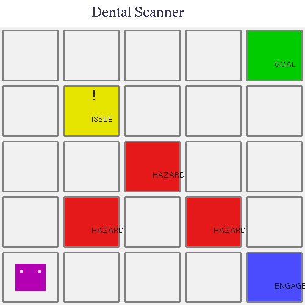

# AI Dental Scanner Assistant - Reinforcement Learning Implementation

This project implements a reinforcement learning model for an AI Dental Scanner Assistant. The system uses RL to improve user experience and classification accuracy in a dental health scanning application.

